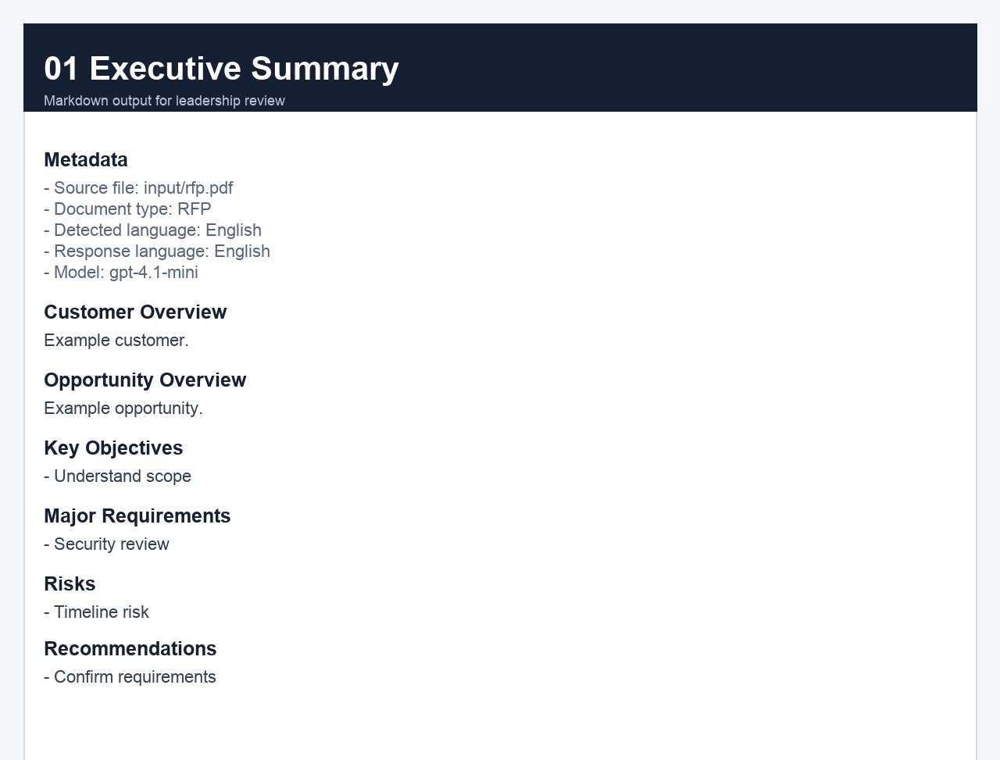
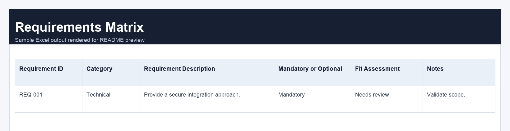
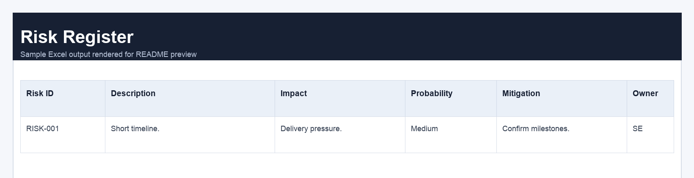
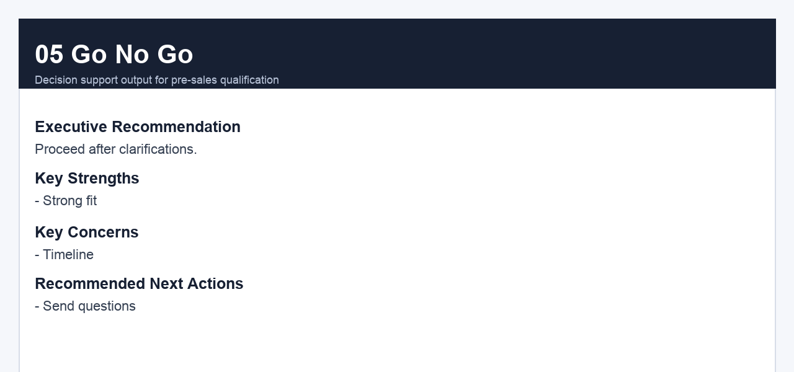

# Pre-Sales Document Assistant

**Turn a 100-page RFP into a structured pre-sales brief in under 60 seconds — powered by the OpenAI API.**

Built for Sales Engineers, Solutions Engineers, Solution Architects, and Bid Managers who need to move fast on procurement opportunities without sacrificing analysis quality.

---

> **By the author of [Manual do Engenheiro de Pré-Vendas](https://www.amazon.com/dp/B0H2FX2YXD)** — available on Amazon US (print) and [Amazon Brazil](https://www.amazon.com.br/dp/B0H2791DC3) (Kindle).

---

## The Problem It Solves

When a customer sends an RFP, RFI, or government tender, a senior SE typically spends **3–6 hours** to:

- Read and extract all technical and commercial requirements
- Identify risks, compliance obligations, and legal constraints
- Draft clarification questions for the customer
- Write a go/no-go recommendation for leadership
- Outline a solution architecture that fits the scope

Pre-Sales Document Assistant automates the entire analysis layer in one command, so SEs can focus on strategy — not document parsing.

**Measured impact:** 3–6 hours of manual procurement review → under 60 seconds.

---

## What It Generates

One command produces 7 structured output files:

| # | Output | Format | Purpose |
|---|--------|--------|---------|
| 1 | Executive Summary | Markdown | Leadership brief — customer context, key objectives, risks, and recommendations |
| 2 | Requirements Matrix | Excel | All requirements extracted and categorized: Technical, Commercial, Security, Legal, Compliance |
| 3 | Risk Register | Excel | Identified risks with impact, probability, mitigation, and owner |
| 4 | Clarification Questions | Markdown | Intelligent questions grouped by Sales, SE, Legal, Security, Product, and Delivery |
| 5 | Go / No-Go Recommendation | Markdown | GO / CONDITIONAL GO / NO-GO with key strengths, concerns, and next actions |
| 6 | Solution Outline | Markdown | Architecture approach, components, delivery considerations, and assumptions |
| 7 | Full Analysis | JSON | Machine-readable output of the complete analysis for downstream integrations |

---

## Quick Start

```bash
# Clone and install
git clone https://github.com/fabricioartur/pre-sales-document-assistant.git
cd pre-sales-document-assistant
pip install -r requirements.txt

# Run the demo instantly — no API key needed
python main.py sample_documents/sample_rfp.pdf --provider mock

# Run with your own document
cp .env.example .env          # add your OPENAI_API_KEY
python main.py input/rfp.pdf --provider openai
```

---

## Model Selection

Three OpenAI models are supported. The right choice depends on document complexity and time pressure:

| Model | Cost (input / output per MTok) | Use When |
|-------|-------------------------------|----------|
| `gpt-5.4-mini` *(default)* | $0.75 / $4.50 | Routine RFPs and RFIs, daily use — fast and cost-efficient |
| `gpt-5.4` | $2.50 / $15.00 | Complex enterprise tenders, compliance-heavy scenarios, final deliverables |
| `gpt-5.5` | $5.00 / $30.00 | Strategic accounts, government bids, board-level go/no-go decisions |

```bash
# Default (fast, cost-efficient)
python main.py input/rfp.pdf --provider openai

# Complex enterprise tender
python main.py input/rfp.pdf --provider openai --model gpt-5.4

# Strategic account — highest quality
python main.py input/rfp.pdf --provider openai --model gpt-5.5
```

The model can also be set via environment variable:

```env
OPENAI_MODEL=gpt-5.4
```

### Reasoning Effort

GPT-5 models support a `--reasoning` flag that controls how deeply the model thinks before producing output. This is the same parameter exposed in OpenAI Codex.

| Level | Use When |
|-------|----------|
| `low` | Fast pass over a short, well-structured RFI — lowest cost |
| `medium` | Balanced quality for standard enterprise procurement documents |
| `high` | Complex multi-section tenders, technical architecture requirements, compliance matrices |
| `extra_high` | Strategic accounts, government bids, final go/no-go for leadership review |

```bash
# High-quality analysis for a complex enterprise tender
python main.py input/rfp.pdf --provider openai --model gpt-5.4 --reasoning high

# Maximum depth for a strategic account
python main.py input/rfp.pdf --provider openai --model gpt-5.5 --reasoning extra_high
```

> **Note:** When `--reasoning` is set, `temperature` is disabled — reasoning models control their own sampling internally.

---

## CLI Reference

```
usage: main.py [-h] [--provider {mock,openai}] [--model MODEL]
               [--reasoning LEVEL] [--output-dir DIR]
               pdf_path

positional arguments:
  pdf_path              Path to the RFP, RFI, or tender PDF.

options:
  --provider {mock,openai}
                        'mock' runs locally without an API key. (default: mock)
  --model MODEL         gpt-5.4-mini | gpt-5.4 | gpt-5.5 (default: gpt-5.4-mini)
  --reasoning LEVEL     low | medium | high | extra_high — reasoning effort for
                        GPT-5 models. Higher effort = deeper analysis, higher cost.
  --output-dir DIR      Directory for generated output files. (default: ./output)
```

---

## Output Previews

### Executive Summary



### Requirements Matrix



### Risk Register



### Go / No-Go Recommendation



---

## Architecture

```
input (.pdf)
      │
      ▼
┌──────────────────────┐
│   pdf_extractor.py   │  validates format, encoding, emptiness
└──────────────────────┘
      │
      ▼
┌──────────────────────┐
│    detectors.py      │  language detection, document type classification,
│                      │  response language detection (local rules, no API)
└──────────────────────┘
      │
      ▼
┌──────────────────────┐   ┌─────────────────────────┐
│  analysis_providers  │──▶│  prompts.py              │
│  (Protocol pattern)  │   │  system_prompt           │
└──────────────────────┘   │  build_user_prompt()     │
      │                    └─────────────────────────┘
      ├── MockAnalysisProvider
      │     • no API key required
      │     • deterministic output for demos and CI
      │
      └── OpenAIAnalysisProvider
            • Responses API (client.responses.create)
            • timeout: 60s
            • retry: 3x with exponential backoff (2s → 4s → 8s)
            • temperature: 0.2 (deterministic) or reasoning effort
      │
      ▼
┌──────────────────────┐
│   output_writer.py   │  Markdown, Excel (openpyxl), JSON
└──────────────────────┘
      │
      ▼
  output/ (7 files)
```

### Architecture Decisions

**Why the Responses API instead of Chat Completions?**
`client.responses.create()` is the current OpenAI API surface and the one that exposes the `reasoning` parameter. Chat Completions is the legacy path. Using the current API also makes the codebase consistent with how OpenAI recommends building on GPT-5 models.

**Why a Protocol for the provider interface?**
The `AnalysisProvider` Protocol (not a base class) allows switching between Mock, OpenAI, Azure OpenAI, or any future provider without touching the orchestration logic. This is the same pluggable-client pattern you would recommend to a customer designing their own LLM integration.

**Why local detection before the API call?**
Language detection and document classification run locally with zero latency. This means the model receives already-labeled context (`document_type`, `detected_language`, `response_language`) and doesn't need to spend tokens inferring metadata that keyword rules can resolve in milliseconds.

**Why retry with exponential backoff?**
Enterprise deployments hit OpenAI rate limits during burst usage. The client retries up to 3 times (2s → 4s → 8s) before failing with a clear error. This is the standard resilience pattern for any API-dependent production service.

**Why `temperature=0.2`?**
Pre-sales documentation must be factual and consistent. Low temperature suppresses hallucination and keeps output reproducible across runs. When `--reasoning` is active, temperature is omitted entirely — reasoning models control their own sampling.

---

## Project Structure

```
pre-sales-document-assistant/
├── main.py                          # CLI entrypoint
├── requirements.txt
├── requirements-dev.txt
├── .env.example
├── .github/
│   └── workflows/ci.yml             # GitHub Actions: test + lint + type-check
├── src/
│   ├── config.py                    # AppConfig, MODEL_CHOICES, REASONING_CHOICES
│   ├── analysis_providers.py        # MockAnalysisProvider, OpenAIAnalysisProvider, Protocol
│   ├── detectors.py                 # Language and document type detection (local rules)
│   ├── models.py                    # AnalysisResult TypedDict
│   ├── output_writer.py             # Markdown, Excel, JSON writers
│   ├── pdf_extractor.py             # pypdf wrapper with validation
│   └── prompts.py                   # System prompt and user prompt builder
├── docs/
│   └── images/                      # README preview screenshots
├── sample_documents/                # Sample procurement PDFs for demo
├── sample_outputs/                  # Pre-generated outputs for reference
├── input/                           # Drop your PDFs here
└── output/                          # Generated files (git-ignored)
```

---

## Testing

```bash
# Full test suite
python -m unittest discover -v

# Lint
ruff check .

# Type check
mypy src/ main.py --ignore-missing-imports
```

---

## Design Philosophy

Pre-Sales Document Assistant is not a chatbot. It is a focused productivity tool for enterprise pre-sales work.

The emphasis is on **structured outputs**, **requirement traceability**, and **decision-ready documentation** — the same principles that should guide any LLM application built for B2B enterprise workflows.

---

## Requirements

- Python 3.9+
- OpenAI API key (not required for `--provider mock`)

---

## License

Copyright (c) 2026 Fabricio Puliafico Artur. Released under the MIT License. See [LICENSE](LICENSE) for details.
